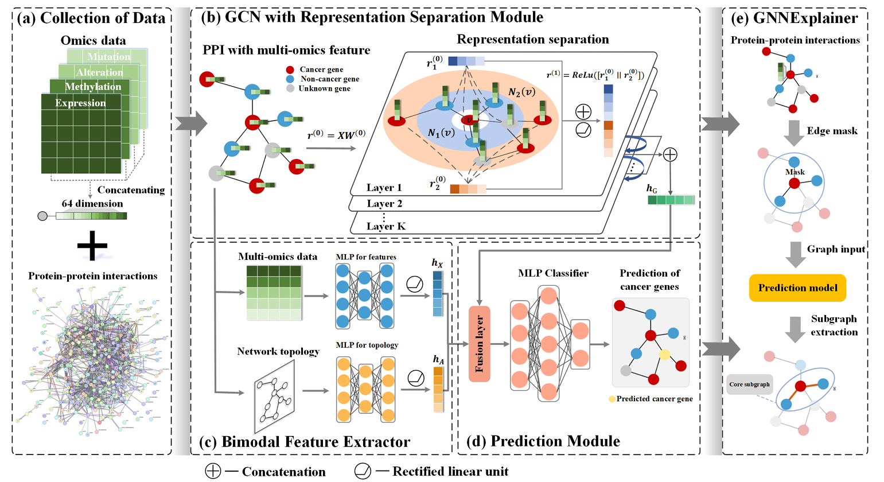

# SGCD
## **Towards Simplified Graph Neural Networks for Identifying Cancer Driver Genes in Heterophilic Networks**
## Description

## Getting Started

### Special dependencies

*   Pytorch 1.10.1
*   Pytorch geometric 2.0.1
*   Sklearn 1.3.2

### Overview

The codes are organized as follows:&#x20;

*   `main.py`: the main script of SGCD.
*   `models.py`: the implementations of models.
*   `utils.py`: the script of data input and output.

### PPI files

*   The organized PPI files are on [EMOGI](https://github.com/schulter/EMOGI).

### How to run

`python main.py`

## Version History

*   0.1
    *   Initial Release

## Acknowledgments

We referred to the code repository of the following repository:&#x20;

*   [pyg-team/pytorch\_geometric](https://github.com/pyg-team/pytorch_geometric)
*   [Node Classification Beyond Homophily: Towards a General Solution, SIGKDD'23](https://github.com/pricexu/ALT)
*   [Tian Ruichao](https://github.com/sheeprra/add.py/tree/master/PyTorch/H2GCN)

