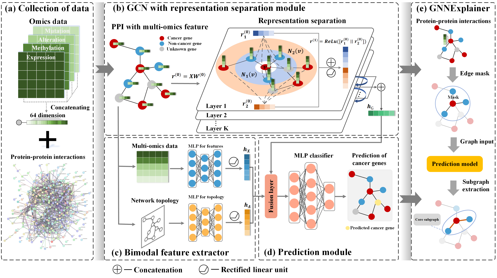

# SGCD
## **Towards Simplified Graph Neural Networks for Identifying Cancer Driver Genes in Heterophilic Networks**
## Description

The identification of cancer driver genes is crucial for understanding the complex processes involved in cancer development, progression, and therapeutic strategies. Multi-omics data and biological networks provided by numerous databases enable the application of graph deep learning techniques that incorporate network structures into the deep learning framework. However, most existing methods do not account for the heterophily in the biological networks, which hinders the improvement of model performance. To address this, we propose a Simple and efficient method based on Graph convolutional networks for identifying Cancer Driver genes in heterophilic networks (SGCD), which comprises primarily two components: a graph convolutional neural network (GCN) with representation separation (RS) and a bimodal feature extractor. The results demonstrate that SGCD not only performs exceptionally well but also exhibits robust discriminative capabilities compared to state-of-the-art methods across all benchmark datasets. Moreover, subsequent interpretability experiments on both the model and biological aspects provide compelling evidence supporting the reliability of SGCD. We are confident that SGCD holds potential in the field of precision oncology and may be applied to prognosticate biomarkers for a wide range of complex diseases.&#x20;

## Getting Started

### Special dependencies

*   Pytorch 1.10.1
*   Pytorch geometric 2.0.1
*   Sklearn 1.3.2

### Overview

The codes are organized as follows:&#x20;

*   `main.py`: the main script of SGCD.
*   `models.py`: the implementations of models.
*   `utils.py`: the script of data input and output.

### PPI files

*   The organized PPI files are on [EMOGI](https://github.com/schulter/EMOGI).

### How to run

`python main.py`

## Version History

*   0.1
    *   Initial Release

## Acknowledgments

We referred to the code repository of the following repository:&#x20;

*   [pyg-team/pytorch\_geometric](https://github.com/pyg-team/pytorch_geometric)
*   [Node Classification Beyond Homophily: Towards a General Solution, SIGKDD'23](https://github.com/pricexu/ALT)
*   [Tian Ruichao](https://github.com/sheeprra/add.py/tree/master/PyTorch/H2GCN)

